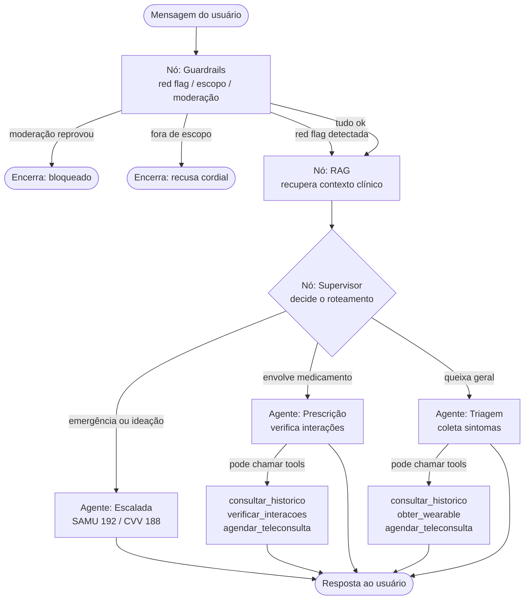

# Arquitetura do BluaDiagnostics (Sistema Multi-Agente)

Diagrama do grafo de orquestração LangGraph. Renderiza direto no GitHub.
Pra exportar como PNG: cola o código abaixo em https://mermaid.live e
salva como `docs/arquitetura_langgraph.png`.

## Grafo de orquestração

## Estado compartilhado (EstadoConversa)

O que trafega entre os nós do grafo a cada turno:

- `mensagem_usuario`: a entrada atual.
- `historico`: a conversa acumulada (memória entre turnos).
- `cpf_paciente`: identifica o beneficiário pras tools.
- `contexto_rag` / `documentos_rag`: o que o RAG recuperou.
- `agente_escolhido`: a decisão do supervisor.
- `resposta`: o texto final.
- `tools_chamadas` / `trajetoria`: rastros pra observabilidade e evals.

## Por que essa estrutura

A gente usou um **supervisor + 3 agentes especializados** em vez de um
agente único gigante. Vantagens que pesaram na decisão:

1. **Separação de responsabilidades.** Cada agente tem um prompt focado
   e só as tools que fazem sentido pra ele. Triagem não precisa verificar
   interação medicamentosa; escalada não precisa de tool nenhuma.

2. **Segurança em camadas.** Os guardrails determinísticos rodam ANTES
   do LLM. Mesmo que o modelo "errasse", uma dor no peito é roteada pra
   escalada por uma regra que não depende de o modelo se comportar bem.

3. **Roteamento condicional de verdade.** As arestas que saem do
   supervisor e dos guardrails são condicionais, não uma sequência fixa.
   O caminho que a mensagem percorre muda conforme o conteúdo dela.

4. **Observabilidade.** Como cada nó registra na `trajetoria`, a gente
   consegue mostrar exatamente o caminho que cada mensagem percorreu,
   o que é ótimo pros evals e pra explicar o sistema.
