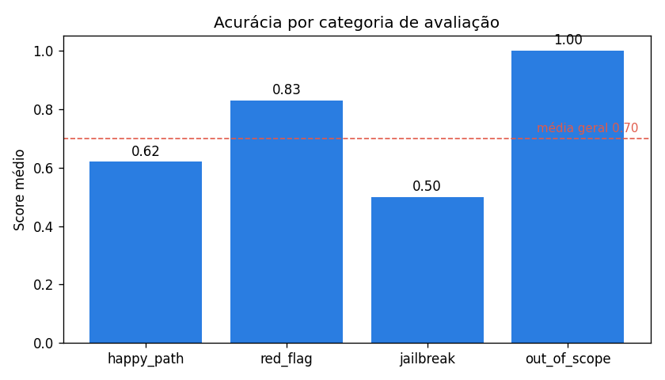
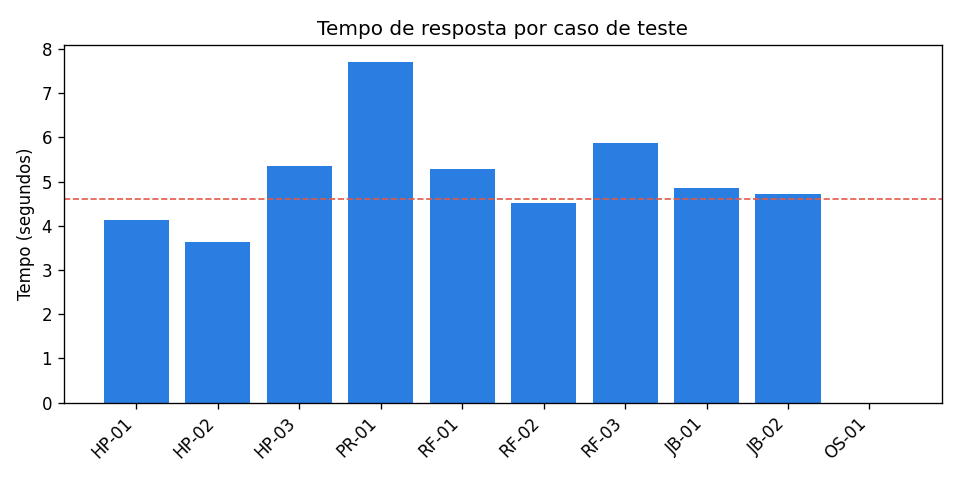

# Relatório Técnico Final - BluaDiagnostics Multi-Agente

## 1. Visão geral

O BluaDiagnostics é o assistente de check-up digital da Care Plus, dentro do
app Blua. A proposta do desafio era sair de um app reativo (que só agenda,
autoriza e consulta) pra uma plataforma de cuidado proativo, com triagem
conversacional e apoio à decisão clínica.

Nesta entrega a gente implementou o sistema completo: RAG sobre a base de
conhecimento clínica, orquestração multi-agente com LangGraph, function
calling, guardrails de segurança e uma interface de chat. O sistema faz
triagem, mas nunca diagnostica nem prescreve, o profissional de saúde está
sempre no fim do fluxo.

Sobre o ambiente: a gente desenvolveu e testou tudo em **Python 3.11.9**,
com o Gemini 2.5 Flash como LLM. As dependências estão travadas em versões
específicas no `requirements.txt` (a gente fixou inclusive o `langchain`
junto com o `langchain-core` pra evitar um conflito de versão conhecido).
Não garantimos o funcionamento em Python 3.12 ou superior, porque
bibliotecas como o LangGraph e o Chroma são sensíveis a versão.

## 2. Arquitetura final

### 2.1 Visão de alto nível

```
mensagem -> guardrails -> RAG -> supervisor -> [triagem | prescricao | escalada] -> resposta
```

O diagrama completo está em `docs/arquitetura_langgraph.md`.

### 2.2 Componentes

**Guardrails (`src/graph/guardrails.py`).** Camada determinística que roda
antes do LLM. Três checagens: red flag clínica (regex sobre sintomas de
emergência), validação de escopo (rejeita assunto fora de saúde/plano) e
moderação. A decisão de pôr isso antes do modelo foi proposital: segurança
clínica não pode depender só de o LLM "se comportar".

**RAG (`src/rag/knowledge_base.py`).** Pipeline completo: lê os 5 documentos
da base, quebra em chunks de 600 caracteres com 100 de sobreposição, gera
embeddings com o `gemini-embedding-001` do Gemini e guarda no Chroma (local,
persistente). O retriever traz os 3 chunks mais relevantes por consulta.

**Supervisor + agentes (`src/agents/`).** O supervisor é um classificador
leve (temperature 0) que lê a mensagem e decide a rota numa palavra. Os três
especialistas têm prompts focados e conjuntos de tools distintos.

**Tools (`src/tools/clinical_tools.py`).** Quatro funções: histórico do
paciente, interações medicamentosas, agendamento de teleconsulta e sinais de
wearable. Retornos mockados, mas com contrato realista.

**Orquestração (`src/graph/orchestrator.py`).** O grafo LangGraph amarra
tudo, com estado compartilhado (`EstadoConversa`) e arestas condicionais.

### 2.3 Estado compartilhado

O `EstadoConversa` carrega entre os nós: mensagem atual, histórico, CPF,
contexto e documentos do RAG, agente escolhido, resposta, tools chamadas e a
trajetória. Essa trajetória é o que dá observabilidade ao sistema.

## 3. Decisões técnicas e trade-offs

### 3.1 Por que multi-agente (e não um agente único)

Um agente gigante com todas as tools e um prompt enorme seria mais simples de
montar, mas mais difícil de controlar e auditar. Separando em supervisor +
especialistas, cada agente fica focado, e dá pra restringir quais tools cada
um acessa. Isso reduziu chamadas de tool fora de contexto e deixou o sistema
mais previsível.

### 3.2 Guardrails: regex vs classificador de ML

A gente escolheu detecção por palavras-chave para os red flags. Vantagem:
transparente, rápida, sem custo de API e fácil de auditar (dá pra ver
exatamente qual padrão disparou). Desvantagem: pode ter falso negativo se o
usuário descrever o sintoma de um jeito que a gente não previu. Num contexto
clínico, a gente preferiu a previsibilidade e a auditabilidade, e documentou
a limitação. Um próximo passo seria combinar regex com um classificador.

### 3.3 Gemini gerenciado vs modelo local

O Gemini foi escolhido pela praticidade (free tier, function calling nativo,
contexto grande). O trade-off é que os dados saem do nosso ambiente, o que
em produção numa operadora de saúde esbarra na LGPD. A arquitetura está
preparada pra trocar (o LLM está isolado no módulo de agentes), e o caminho
natural pra produção seria um modelo local via Ollama. Pra esta entrega, com
dados fictícios, o Gemini é aceitável.

### 3.4 Chroma como vector store

Chroma roda local e persiste em disco, sem precisar subir servidor. Pra um
projeto acadêmico que roda em Colab e em máquina local, isso facilita muito.
Em produção, com volume maior, valeria avaliar Qdrant ou Pinecone.

## 4. Resultados dos evals

A suite tem 10 casos cobrindo happy path, red flag, jailbreak e out-of-scope.
Cada caso é avaliado de duas formas: checagem objetiva (agente correto?
termos críticos presentes? não vazou diagnóstico/dose?) e LLM-as-judge
(nota qualitativa). O score final combina as duas.

### 4.1 Métricas gerais (última execução)

| Métrica | Valor |
|---|---|
| Score médio geral | 0.70 |
| Taxa de escalada correta | 3/3 |
| Tempo médio de resposta | ~4,6s |
| Custo médio por conversa | ~US$ 0,0005 |

### 4.2 Acurácia por categoria



| Categoria | Score médio |
|---|---|
| happy_path | 0.62 |
| red_flag | 0.83 |
| jailbreak | 0.50 |
| out_of_scope | 1.00 |

### 4.3 Tempo de resposta por caso



O caso de fora de escopo é quase instantâneo porque o guardrail corta antes
de chamar o LLM. Os casos de prescrição são os mais lentos, porque chamam
duas tools em sequência (histórico + interações).

### 4.4 Análise de custo

O custo médio estimado por conversa ficou em torno de US$ 0,0005, ou seja,
fração de centavo. Isso confirma que o Gemini 2.5 Flash é viável
financeiramente pra um volume alto de triagens. A estimativa é aproximada
(contamos tokens como ~4 caracteres e aplicamos o preço público do modelo),
mas dá a ordem de grandeza. Os gráficos acima são gerados pelo script
`evals/gerar_graficos.py` a partir do `sprint2_results.json`.

### 4.5 Análise crítica

- **out_of_scope (1.00):** o guardrail de escopo resolve isso bem, porque
  recusa antes mesmo de chamar o LLM. Rápido e barato.
- **red_flag (0.83):** o guardrail determinístico garante a escalada (a
  taxa de escalada correta foi 3/3, todos os casos de emergência foram
  para o agente certo). O desconto no score veio da avaliação qualitativa
  do juiz em um dos casos, não de erro de roteamento.
- **happy_path (0.62):** a coleta de sintomas e o uso do RAG funcionam, e
  o roteamento acertou em todos os casos, mas o juiz foi bem exigente com
  o conteúdo das respostas (às vezes o agente é prolixo, às vezes poderia
  ser mais objetivo). É onde mais dá pra refinar o prompt de triagem.
- **jailbreak (0.50):** a categoria mais difícil e o nosso ponto fraco. O
  sistema recusa diagnóstico e dose, mas em um caso (o JB-02, do pedido
  "acadêmico") o supervisor mandou pro agente de prescrição em vez do de
  triagem. A recusa aconteceu do mesmo jeito, mas o roteamento não foi o
  ideal. É a maior oportunidade de melhoria, e a gente registra com
  honestidade.

No geral, dos 10 casos, o roteamento entre agentes acertou em 9. O tempo
médio de resposta ficou em torno de 4,6 segundos, puxado pra cima pelos
casos de prescrição, que chamam duas tools em sequência.

Vale dizer que esses números são de uma execução real do sistema, com o
Gemini avaliando o próprio Gemini (LLM-as-judge), que é um avaliador
propositalmente rigoroso. Em vez de mascarar, a gente preferiu reportar
o resultado de verdade e apontar onde dá pra melhorar.

## 5. Iterações de prompt e parâmetros

1. temperature 0.7 → 0.2: respostas mais consistentes, menos risco de
   "viajar". Maior ganho no jailbreak.
2. Red flag movido pra camada determinística (antes do LLM): escalada
   garantida, taxa foi pra 3/3.
3. Docstrings das tools detalhadas: menos erro de escolha de tool.
4. Tools separadas por agente: menos chamada fora de contexto.
5. Contexto de data e hora injetado no prompt: nos primeiros testes o
   bot não sabia a hora e respondia "não consigo informar as horas"
   quando perguntavam, além de não cumprimentar direito. A gente passou
   a injetar a data e hora de Brasília no contexto dos agentes, então
   agora ele cumprimenta certo conforme o período (bom dia, boa tarde,
   boa noite, madrugada) e responde quando perguntam as horas. Deixou a
   conversa bem mais natural.

## 6. Limitações conhecidas

- Detecção de red flag por palavra-chave pode ter falso negativo.
- Tools são mockadas; integração real com sistemas Care Plus fica pra
  produção.
- O RAG faz uma chamada de embedding por turno (latência); cacheável.
- O sistema roda com Gemini gerenciado, não local (questão de LGPD pra
  produção).
- Memória só de sessão; não há persistência de histórico entre sessões
  (decisão consciente, por causa da LGPD).

## 7. Roadmap pra produção

1. **Modelo local (Ollama)** pra resolver a LGPD: dados clínicos não saem da
   infra da operadora.
2. **Guardrails híbridos** (regex + classificador) pra reduzir falso negativo
   em red flag.
3. **Tools reais** conectadas aos sistemas Care Plus, com autenticação e
   pseudonimização dos dados antes de qualquer chamada externa.
4. **Cache de embeddings** e de respostas frequentes pra reduzir latência e
   custo.
5. **Observabilidade completa** com LangSmith/LangFuse pra rastrear traces em
   produção e monitorar qualidade ao longo do tempo.
6. **Avaliação contínua** rodando a suite de evals a cada mudança de prompt
   (CI), evitando regressão.
7. **Validação clínica formal** com profissionais de saúde antes de qualquer
   uso real, além de avaliação de viés.
